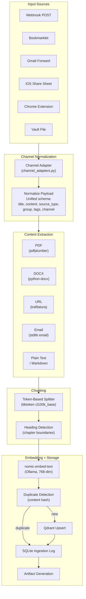
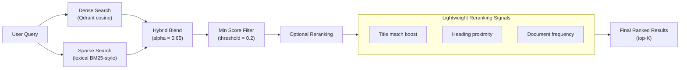
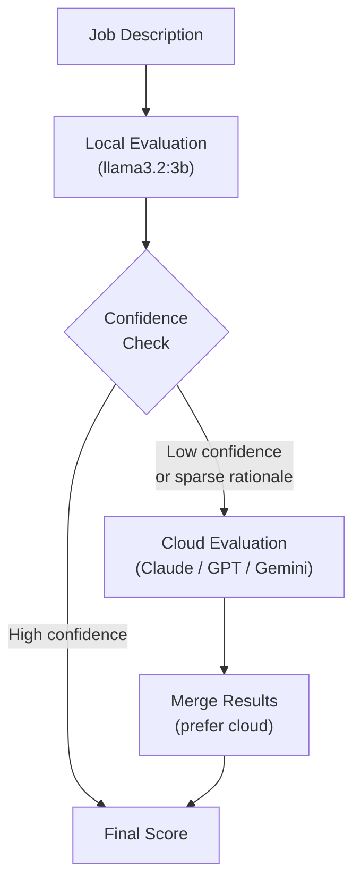
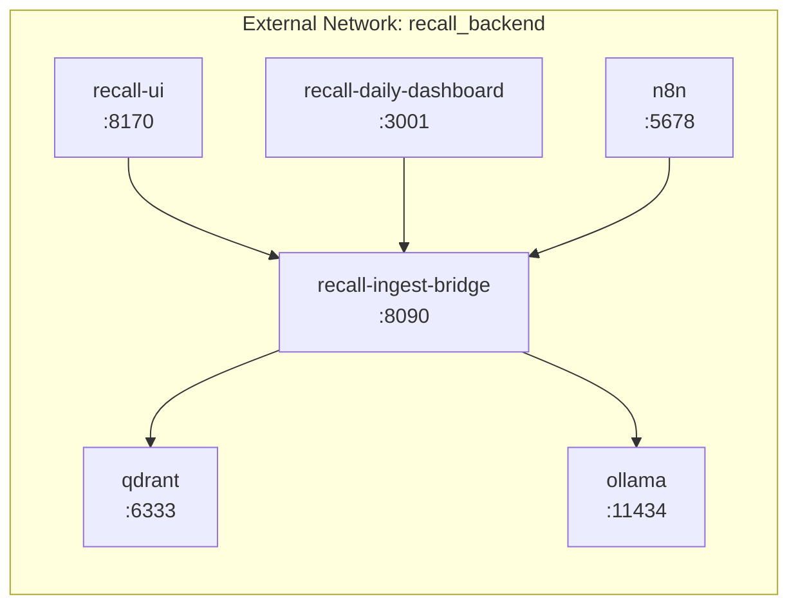

# Architecture Deep Dive

This document covers the three core architectural patterns in Recall.local: the dual-memory system, the ingestion pipeline, and the LLM abstraction layer. For the high-level overview, see [README.md](README.md). For design tradeoffs, see [docs/Recall_local_Design_Decisions.md](docs/Recall_local_Design_Decisions.md).

---

## Dual-Memory System

Recall.local stores information in two complementary systems rather than a single vector store.

### Qdrant (Semantic Memory)

Qdrant holds chunked document embeddings for retrieval. Three collections serve different domains:

| Collection | Purpose | Typical Content |
|-----------|---------|-----------------|
| `recall_docs` | General knowledge base | Articles, notes, bookmarks, emails, meeting transcripts |
| `recall_jobs` | Job listings | Job descriptions with metadata (company, location, source, status) |
| `recall_resume` | Resume reference | Current resume chunks used for fit evaluation |

Each vector payload carries structured metadata:

```
{
  "text": "chunk content...",
  "doc_id": "abc123",
  "chunk_id": "abc123_chunk_002",
  "source_type": "pdf",
  "ingestion_channel": "webhook",
  "group": "job-search",
  "tags": ["interview", "openai"],
  "title": "Senior SE Role - OpenAI",
  "ingested_at": "2025-12-01T10:30:00Z"
}
```

Embeddings use `nomic-embed-text` (768 dimensions) via Ollama, keeping embedding generation local and private.

### SQLite (Operational State)

SQLite stores everything that needs structured queries, dashboards, and audit trails:

| Table | Purpose |
|-------|---------|
| `runs` | Execution history: workflow, status, model, latency, output paths |
| `eval_results` | Evaluation outcomes with citation validation scores |
| `alerts` | Observability events: severity, status, linked run IDs |
| `ingestion_log` | Every ingestion operation with timestamp, group, tags, content hash |
| `resume_versions` | Resume version tracking for Phase 6 |
| `company_profiles` | Company intelligence: tier, connections, metadata |
| `settings` | LLM configuration: model selection, escalation thresholds |

### Why Two Systems

Vector databases answer "what is semantically similar?" SQLite answers "what happened, when, and what was the outcome?" Together they support:

- Cited answers with source attribution (Qdrant retrieves, SQLite logs)
- Dashboard aggregations (job counts by status, eval pass rates over time)
- Audit trails (who ingested what, which model was used, what score was produced)
- Operational decisions (should this job be re-evaluated? has this document changed?)

A single vector store cannot efficiently serve structured aggregation queries. A single relational DB cannot efficiently serve semantic similarity search. The dual approach accepts the complexity cost in exchange for clean separation of retrieval and operational concerns.

---

## Ingestion Pipeline

The ingestion pipeline converts diverse source formats into embedded, searchable chunks with full audit logging.

### Data Flow



### Channel Adapters

Every ingestion source sends a different payload shape. The channel adapter layer normalizes them into a unified schema before any processing begins:

```python
# Unified schema after normalization
{
    "title": str,           # Document title (inferred if missing)
    "content": str,         # Raw content or URL to fetch
    "source_type": str,     # "pdf", "url", "text", "email", "gdoc", etc.
    "group": str,           # Canonical group: "job-search", "learning", "reference", etc.
    "tags": list[str],      # Freeform tags for filtering
    "channel": str,         # Origin: "webhook", "bookmarklet", "gmail-forward", etc.
    "source_key": str,      # Dedup key (URL or content hash)
}
```

Supported channels: `webhook`, `bookmarklet`, `ios-share`, `gmail-forward`, `chrome-extension`, `vault-sync`.

### Chunking Strategy

Documents are split using a token-based approach rather than character-based splitting:

- **Chunk size**: 400 tokens (configurable via `RECALL_CHUNK_TOKENS`)
- **Overlap**: 60 tokens (configurable via `RECALL_CHUNK_OVERLAP`)
- **Tokenizer**: `tiktoken` with `cl100k_base` encoding
- **Heading detection**: Chunks prefer to break at heading boundaries when possible, preserving document structure

### Duplicate Detection

Every ingested document is hashed. If a document with the same content hash already exists in the target collection, the ingestion is logged but no new vectors are created. This prevents re-embedding unchanged vault files or re-submitted webhooks.

---

## Hybrid Retrieval

The retrieval system goes beyond basic vector similarity to improve precision.

### Retrieval Modes

| Mode | Description | When to Use |
|------|-------------|-------------|
| `vector` | Dense embedding similarity only | Default; good for semantic questions |
| `hybrid` | Dense + sparse lexical, blended by alpha | When exact terms matter (names, acronyms, titles) |
| `bm25` | Sparse lexical search only | Keyword-heavy lookups |

### Hybrid Ranking Pipeline



- **Alpha** (`RECALL_RAG_HYBRID_ALPHA`): Controls the blend between dense (1.0) and sparse (0.0). Default 0.65 favors dense.
- **Candidate multiplier** (`RECALL_RAG_HYBRID_CANDIDATE_MULTIPLIER`): Fetches 4x the final top-K from each source before blending.
- **Reranking** (`RECALL_RAG_ENABLE_RERANK`): Optional lightweight reranking layer that boosts results matching query terms in titles or headings. Adds latency but improves precision for structured content.

### Cited RAG Generation

After retrieval, the RAG pipeline:

1. **Detects query pattern** (list, comparison, steps, summary, explanatory) and selects the appropriate system prompt
2. **Checks sensitivity** to block queries about API keys, passwords, or credentials
3. **Builds context** from retrieved chunks with source attribution markers
4. **Generates an answer** using the configured LLM provider
5. **Validates the output** against unanswerable patterns and citation existence
6. **Returns citations** with doc_id + chunk_id so the caller can link back to sources

---

## LLM Abstraction Layer

All LLM interactions go through `scripts/llm_client.py`, which provides a unified interface across four providers.

### Provider Interface

```python
# Generation (any provider)
response: str = generate(
    prompt="What are the key takeaways from...",
    system="You are a helpful assistant...",
    temperature=0.2,
    max_tokens=640,
    trace_metadata={"workflow": "rag-query", "run_id": "abc123"}
)

# Embedding (Ollama only, local-first)
vector: list[float] = embed("text to embed")
```

### Provider Selection

| Provider | Env Var | Default Model | Use Case |
|----------|---------|---------------|----------|
| `ollama` | `OLLAMA_MODEL` | `qwen2.5:7b-instruct` | Default for all workflows |
| `anthropic` | `ANTHROPIC_MODEL` | `claude-sonnet-4-20250514` | Cloud escalation |
| `openai` | `OPENAI_MODEL` | `gpt-4o-mini` | Cloud escalation |
| `gemini` | `GEMINI_MODEL` | `gemini-2.5-flash` | Cloud escalation |

Set the active provider with `RECALL_LLM_PROVIDER`. Embeddings always use Ollama regardless of the generation provider, keeping the embedding space consistent and local.

### Cloud Escalation Pattern

The Phase 6 job evaluator demonstrates the escalation pattern:



Escalation triggers:
- Gap count exceeds threshold
- Confidence score below threshold
- Rationale word count below minimum (indicates the model struggled to explain its reasoning)

This pattern preserves the local-first story while acknowledging that some tasks benefit from stronger models. The escalation is explicit, configurable, and auditable.

### Retry and Resilience

Both generation and embedding calls include:
- Configurable retry count (`RECALL_GENERATE_RETRIES`, `RECALL_EMBED_RETRIES`)
- Exponential backoff (`RECALL_GENERATE_BACKOFF_SECONDS`, `RECALL_EMBED_BACKOFF_SECONDS`)
- Timeout enforcement for Ollama (`RECALL_OLLAMA_GENERATE_TIMEOUT_SECONDS`)
- Character bounds for embeddings (`RECALL_EMBED_MIN_CHARS`, `RECALL_EMBED_MAX_CHARS`)

### Optional Tracing

When Langfuse credentials are configured (`LANGFUSE_PUBLIC_KEY` + `LANGFUSE_SECRET_KEY`), every generation call is traced with:
- Prompt and system message
- Model, temperature, max_tokens
- Response text and latency
- Custom metadata (workflow name, run ID, query pattern)

This enables post-hoc quality analysis without modifying the generation code path.

---

## Service Topology

The Docker Compose stack runs the following services:



| Service | Image | Port | Health Check |
|---------|-------|------|-------------|
| `qdrant` | `qdrant/qdrant:latest` | 6333 | HTTP readiness probe |
| `ollama` | `ollama/ollama:latest` | 11434 | Started |
| `n8n` | `n8nio/n8n:latest` | 5678 | Started |
| `recall-ingest-bridge` | Custom (Dockerfile) | 8090 | `GET /v1/healthz` |
| `recall-ui` | Custom (React + nginx) | 8170 | Depends on bridge |
| `recall-daily-dashboard` | Custom (React + nginx) | 3001 | Depends on bridge |

All services use `restart: unless-stopped` and communicate over the `recall_backend` external network. Qdrant and Ollama use external named volumes for persistence across compose rebuilds.

---

## Further Reading

- [Design Decisions](docs/Recall_local_Design_Decisions.md) &mdash; Architectural tradeoffs explained
- [API Reference](docs/Recall_local_API_Reference.md) &mdash; Endpoint guide with resource model
- [Observability Strategy](docs/OBSERVABILITY_STRATEGY.md) &mdash; Telemetry and monitoring approach
- [Implementation Log](docs/IMPLEMENTATION_LOG.md) &mdash; Chronological build history
