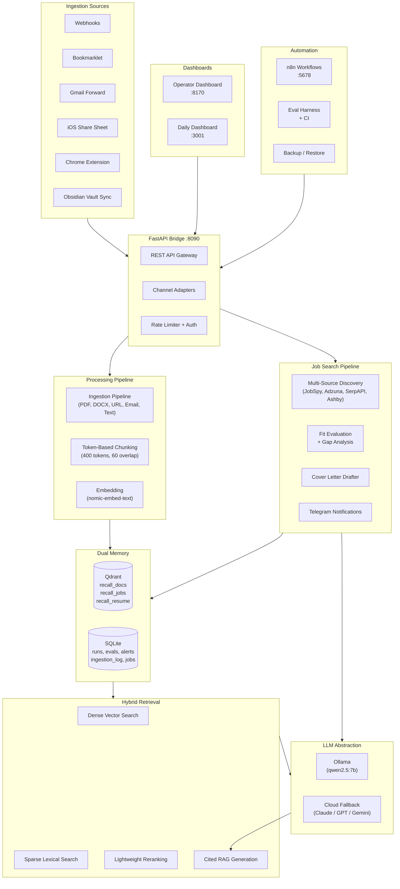

# Recall.local

[](https://github.com/jaydreyer/recall-local/actions/workflows/quality_checks.yml)


A local-first AI operations system that combines document ingestion, cited RAG retrieval, and job-search automation into a single, self-hosted platform. Built as a portfolio project for solutions engineering and applied AI roles.

**The goal is not just working features** &mdash; it's a system that is explainable under code review, defensible in a live walkthrough, and operationally observable end to end.

---

## Why This Exists

Most AI portfolio projects are thin wrappers around a hosted API. Recall.local is different:

- **Local-first**: Runs on Ollama + Qdrant + SQLite. No API keys required to start.
- **Cloud-ready**: Swappable LLM backend (Anthropic, OpenAI, Gemini) with automatic escalation when local confidence is low.
- **Full-stack operations**: Not just inference &mdash; ingestion pipelines, hybrid retrieval, evaluation harnesses, backup/restore, dashboards, and workflow automation.
- **Interview-ready**: Every design choice has a documented tradeoff. Every workflow has an eval. Every phase has a runbook.

---

## Architecture



For deeper technical detail, see [ARCHITECTURE.md](ARCHITECTURE.md).

---

## Features

### Document Ingestion
- Multi-source ingestion: webhooks, bookmarklet, Gmail forwards, iOS share sheets, Chrome extension, Obsidian vault sync
- Content extraction from PDF, DOCX, TXT, Markdown, HTML, email, URLs, and Google Docs
- Token-based chunking with configurable overlap and automatic heading detection
- Duplicate detection via content hashing with full audit trail in SQLite

### Cited RAG Retrieval
- Hybrid retrieval blending dense vector search with sparse lexical matching
- Lightweight reranking using title matching, heading proximity, and document frequency
- Source-attributed answers with doc_id + chunk_id citations
- Multi-pattern query handling: list, comparison, step-by-step, summary, explanatory
- Sensitivity detection to block queries about secrets or credentials

### Job Search Automation
- Multi-source job aggregation from JobSpy, Adzuna, SerpAPI, and Ashby career pages
- Resume-grounded fit scoring with weighted scorecard (role, technical, domain, seniority)
- Skill gap detection and cross-job gap aggregation with semantic clustering
- Cover letter drafting grounded in job description + resume context
- Company intelligence profiles with tier ranking and network tracking
- Telegram push notifications for high-fit discoveries

### Obsidian Vault Integration
- Bidirectional sync with filesystem watching and content-hash deduplication
- Auto-tag extraction from YAML frontmatter, wiki links, hashtags, and custom rules
- Configurable directory exclusions and optional write-back to vault

### Operations & Observability
- OpenTelemetry tracing with Honeycomb integration
- Langfuse LLM tracing for generation quality monitoring
- Evaluation harness with golden question sets, citation validation, and trend analysis
- Full-state backup and restore for Qdrant + SQLite
- Smoke tests, preflight checks, and deterministic restart scripts
- CI pipeline: syntax checks, pytest + coverage, pip-audit, wrapper smoke tests

### Dashboards
- **Operator Dashboard** (React 19 + Vite): Job triage, gap analysis, company profiles, cover letter preview
- **Daily Dashboard** (React 18 + Recharts): Job trends, eval progress, gap frequency charts

---

## Tech Stack

| Layer | Technology |
|-------|-----------|
| **API** | FastAPI 0.135 &middot; Uvicorn &middot; OpenAPI/Swagger |
| **Vector DB** | Qdrant 1.17 (cosine similarity, hybrid search) |
| **Relational DB** | SQLite (operational state, audit trails) |
| **LLM Runtime** | Ollama (local) &middot; Anthropic &middot; OpenAI &middot; Gemini |
| **Embeddings** | nomic-embed-text via Ollama (768-dim) |
| **Document Parsing** | pdfplumber &middot; python-docx &middot; trafilatura |
| **Frontend** | React &middot; Vite &middot; Recharts |
| **Automation** | n8n (self-hosted workflows) |
| **Observability** | OpenTelemetry &middot; Langfuse &middot; Honeycomb |
| **Infrastructure** | Docker Compose &middot; GitHub Actions CI |
| **Language** | Python 3.11+ &middot; JavaScript (ES2022) |

---

## Quick Start

### Prerequisites

- Docker and Docker Compose
- 8 GB+ RAM (for Ollama model serving)
- GPU recommended but not required

### 1. Clone and configure

```bash
git clone https://github.com/jaydreyer/recall-local.git
cd recall-local
cp docker/.env.example docker/.env
# Edit docker/.env with your settings (defaults work for local-only mode)
```

### 2. Create external resources

```bash
docker network create recall_backend
docker volume create docker_qdrant-storage
docker volume create docker_ollama-models
```

### 3. Start the stack

```bash
docker compose -f docker/docker-compose.yml up -d
```

### 4. Pull the default model

```bash
docker exec -it recall-ollama ollama pull qwen2.5:7b-instruct
docker exec -it recall-ollama ollama pull nomic-embed-text
```

### 5. Bootstrap databases

```bash
docker exec recall-ingest-bridge python scripts/phase0/bootstrap_sqlite.py
docker exec recall-ingest-bridge python scripts/phase0/bootstrap_qdrant.py
```

### 6. Verify

```bash
# Health check
curl http://localhost:8090/v1/healthz

# Interactive API docs
open http://localhost:8090/docs

# Operator dashboard
open http://localhost:8170

# Daily dashboard
open http://localhost:3001
```

### Local development (no Docker)

```bash
python3 -m venv .venv
source .venv/bin/activate
pip install -r requirements.txt -r requirements-dev.txt

# Run tests
python3 -m pytest tests/ -q --cov=scripts --cov-report=term-missing
```

---

## Project Structure

```
recall-local/
├── scripts/                     # Core execution logic (76 files)
│   ├── llm_client.py            #   Unified LLM provider interface (Ollama/Anthropic/OpenAI/Gemini)
│   ├── validate_output.py       #   JSON and output format validation
│   ├── phase0/                  #   Bootstrap: SQLite schema, Qdrant collections, connectivity
│   ├── phase1/                  #   FastAPI bridge, ingestion pipeline, hybrid retrieval, RAG
│   ├── phase2/                  #   Meeting action item extraction, domain manifests
│   ├── phase3/                  #   Backup/restore, portfolio bundle, operational wrappers
│   ├── phase4/                  #   Eval trend analysis, soak testing, repo hygiene
│   ├── phase5/                  #   Obsidian vault sync, operator stack management
│   ├── phase6/                  #   Job discovery, evaluation, cover letters, Telegram alerts
│   └── eval/                    #   Evaluation harness, golden sets, model bakeoffs
├── tests/                       # 182+ tests, 49% coverage (29 files)
│   ├── conftest.py              #   Shared fixtures (temp DBs, mocked LLM clients)
│   ├── test_bridge_api_contract.py  #   FastAPI endpoint contract validation
│   └── ...                      #   Phase-specific regression suites
├── ui/                          # React dashboards
│   ├── dashboard/               #   Operator panel (React 19, Vite)
│   └── daily-dashboard/         #   Job triage view (React 18, Recharts)
├── docker/                      # Container orchestration
│   ├── docker-compose.yml       #   Full production stack (7 services)
│   ├── .env.example             #   Configuration template (90+ variables)
│   └── bridge/Dockerfile        #   Bridge container build
├── n8n/                         # Workflow automation
│   ├── workflows/               #   Importable n8n workflow JSONs
│   └── payload_examples/        #   Sample payloads for each workflow
├── docs/                        # Documentation (56 files)
│   ├── Recall_local_Architecture_Diagram.md
│   ├── Recall_local_Design_Decisions.md
│   ├── Recall_local_API_Reference.md
│   ├── IMPLEMENTATION_LOG.md    #   Chronological change history
│   └── ...                      #   PRDs, runbooks, phase guides, eval docs
├── prompts/                     # LLM system prompts (10 files)
├── config/                      # Application config (tag rules, job search, career pages)
├── chrome-extension/            # Manifest V3 Chrome extension
├── pyproject.toml               # Project metadata, ruff + pytest config
├── requirements.txt             # Pinned runtime dependencies (17 packages)
└── requirements-dev.txt         # Pinned dev dependencies (pytest, ruff, pip-audit)
```

---

## API Documentation

The FastAPI bridge publishes interactive docs at runtime:

| Format | URL |
|--------|-----|
| Swagger UI | `http://localhost:8090/docs` |
| ReDoc | `http://localhost:8090/redoc` |
| OpenAPI JSON | `http://localhost:8090/openapi.json` |

Endpoint groups: Health, Ingestions, RAG Queries, Meeting Action Items, Vault, Jobs, Resumes, Companies, LLM Settings, Cover Letter Drafts, Evaluations, Activities, Dashboard.

Full reference: [docs/Recall_local_API_Reference.md](docs/Recall_local_API_Reference.md)

---

## Testing

```bash
python3 -m pytest tests/ -q --cov=scripts --cov-report=term-missing
```

| Metric | Value |
|--------|-------|
| Passing tests | 182+ |
| Coverage | 49.62% |
| CI floor | 25% minimum |
| Test files | 29 |

The test strategy prioritizes **contract tests** (API surface) and **regression tests** (highest-risk logic) over exhaustive unit coverage. Key test files:

- `test_bridge_api_contract.py` &mdash; FastAPI endpoint validation
- `test_phase1_phase6_cover_letter_flow_pytest.py` &mdash; Cross-phase integration
- `test_phase6c_evaluation_observation.py` &mdash; Evaluation pipeline + telemetry
- `test_phase6_storage_pytest.py` &mdash; Data persistence layer

CI runs on every push and PR: syntax checks, pytest + coverage, `pip-audit` vulnerability scan, and wrapper smoke tests.

---

## Design Decisions

Every architectural choice is documented with its tradeoff:

| Decision | Rationale |
|----------|-----------|
| **Local-first runtime** | Demonstrates self-hosted AI design; privacy and latency are part of the product story |
| **Dual memory model** | Qdrant for semantic retrieval + SQLite for dashboards and audit trails |
| **Thin API gateway** | Single FastAPI bridge as the shared contract for all clients |
| **Hybrid retrieval** | Dense + lexical + reranking beats naive cosine similarity |
| **Conditional cloud escalation** | Local models handle the common case; cloud handles the hard case |
| **Artifact-driven ops** | Demos and debugging grounded in saved evidence, not claims |

Full discussion: [docs/Recall_local_Design_Decisions.md](docs/Recall_local_Design_Decisions.md)

---

## Roadmap

### Completed

| Phase | Scope | Status |
|-------|-------|--------|
| Phase 0 | Infrastructure bootstrap (SQLite, Qdrant, connectivity) | Done |
| Phase 1 | Unified ingestion + cited RAG (6 input channels, hybrid retrieval) | Done |
| Phase 2 | Meeting action item extraction (Workflow 03) | Done |
| Phase 3 | Backup/restore, ops hardening, portfolio bundle | Done |
| Phase 4 | Evaluation harness, trend analysis, CI automation | Done |
| Phase 5 | Obsidian vault sync, operator dashboards, API hardening | Done |
| Phase 6A | Job search foundation (collections, resume, company profiles) | Done |
| Phase 6B | Multi-source job discovery (JobSpy, Adzuna, SerpAPI, Ashby) | Done |
| Phase 6C | AI-powered fit evaluation, gap analysis, Telegram alerts | Done |
| Phase 6D | Daily dashboard, cover letter drafter, cache warming | Done |

### Up Next

- Expanded test coverage for phases 0-4
- Agentic multi-step workflows (tool-using RAG)
- Calendar and scheduling integration
- Interview prep content generation

---

## Documentation

| Document | Purpose |
|----------|---------|
| [Architecture Diagram](docs/Recall_local_Architecture_Diagram.md) | Visual system overview |
| [Design Decisions](docs/Recall_local_Design_Decisions.md) | Tradeoffs explained |
| [API Reference](docs/Recall_local_API_Reference.md) | Endpoint guide |
| [Implementation Log](docs/IMPLEMENTATION_LOG.md) | Chronological change history |
| [Environment Inventory](docs/ENVIRONMENT_INVENTORY.md) | Runtime configuration |
| [ARCHITECTURE.md](ARCHITECTURE.md) | Deep dive: dual memory, ingestion pipeline, LLM abstraction |
| [Observability Strategy](docs/OBSERVABILITY_STRATEGY.md) | Telemetry and monitoring |

---

## License

[MIT](LICENSE)
