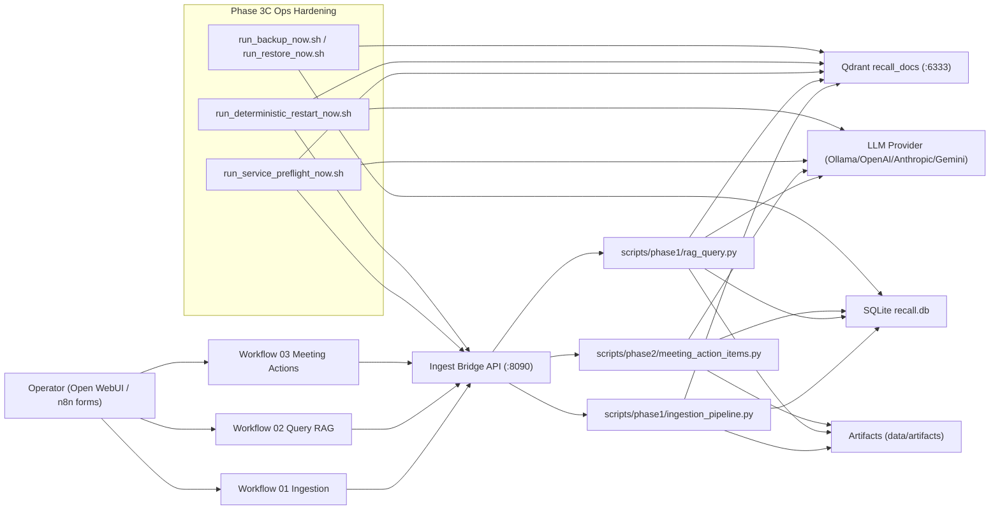

# Recall.local Architecture Diagram

```mermaid
flowchart LR
  U["Operator (Open WebUI / n8n forms)"] --> W1["Workflow 01 Ingestion"]
  U --> W2["Workflow 02 Query RAG"]
  U --> W3["Workflow 03 Meeting Actions"]

  W1 --> B["Ingest Bridge API (:8090)"]
  W2 --> B
  W3 --> B

  B --> P1["scripts/phase1/ingestion_pipeline.py"]
  B --> P2["scripts/phase1/rag_query.py"]
  B --> P3["scripts/phase2/meeting_action_items.py"]

  P1 --> Q["Qdrant recall_docs (:6333)"]
  P1 --> S["SQLite recall.db"]
  P2 --> Q
  P2 --> S
  P3 --> S

  P2 --> L["LLM Provider (Ollama/OpenAI/Anthropic/Gemini)"]
  P3 --> L

  P1 --> A["Artifacts (data/artifacts)"]
  P2 --> A
  P3 --> A

  subgraph Ops["Phase 3C Ops Hardening"]
    R1["run_service_preflight_now.sh"]
    R2["run_deterministic_restart_now.sh"]
    R3["run_backup_now.sh / run_restore_now.sh"]
  end

  R1 --> B
  R1 --> Q
  R1 --> L
  R2 --> B
  R2 --> Q
  R2 --> L
  R3 --> S
  R3 --> Q
```
